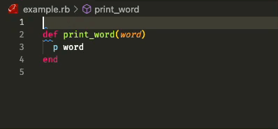

# Simple YARD Snippets

Simple YARD Snippets helps developers to write YARD comments quickly.

### All the supported types:

- `@param`
- `@option`
- `@return`
- `@raise`
- `@example`
- `@todo`
- `@yield`
- `@yieldparam`
- `@yieldreturn`

To print the snippet of selected method start typing the name without `@` sign.

### 1.0.0

Initial release of Simple YARD Snippets
